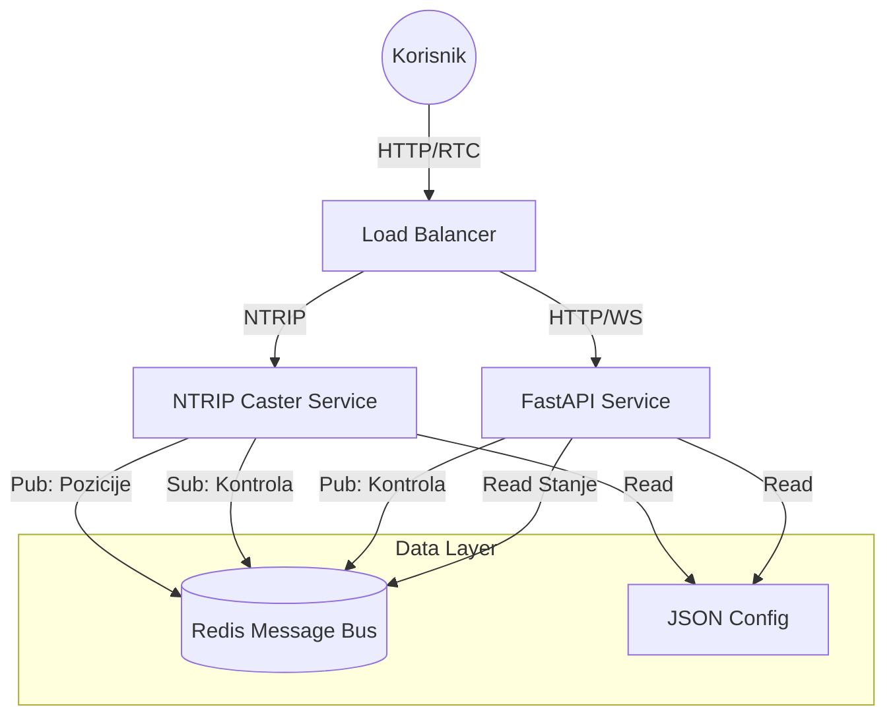

# NTRX Arhitektura

## Pregled

NTRX je asinhroni NTRIP Caster visokih performansi napisan u Python-u. Koristi Redis za komunikaciju između procesa (IPC), omogućavajući stateless, skalabilnu arhitekturu koja razdvaja osnovnu Caster logiku od API i Control slojeva.

## Dizajn Visokog Nivoa (High-Level Design)



## Detaljna Interakcija Komponenti

```text
+---------------------+       +----------------------+       +-----------------------+
|  NTRIP Izvori       | --->  |   NTRX Caster        | --->  |   NTRIP Klijenti      |
|  (Bazne Stanice)    | <---  |   (AsyncIO Loop)     | <---  |   (Roveri)            |
+---------------------+       +----------+-----------+       +-----------------------+
                                         |
                                         | (Interni Događaj: Pozicija Klijenta)
                                         v
                              +----------------------+
                              |   Redis Pub/Sub      |
                              |   Kanal: positions   |
                              +----------+-----------+
                                         ^
                                         |
+---------------------+       +----------+-----------+
|  Admin / API Koris. | --->  |   FastAPI Service    |
|  (Kill Switch)      |       |   (AsyncIO Loop)     |
+---------------------+       +----------+-----------+
                                         |
                                         v
                              +----------------------+
                              |   Redis Pub/Sub      |
                              |   Kanal: control     |
                              +----------------------+
```

## Redis Šema

Sistem koristi Redis kao centralni nervni sistem za stanje i kontrolu.

### Kanali (Pub/Sub)

| Ime Kanala        | Izdavač (Pub) | Pretplatnik (Sub) | Payload (JSON)                                    | Opis |
|-------------------|---------------|-------------------|---------------------------------------------------|------|
| `ntrip:positions` | Caster        | Konzumenti        | `{"username": "u1", "nmea": "$..", "ts": 123.4}` | Live stream pozicija klijenata (NMEA GPGGA). |
| `ntrip:control`   | API           | Caster            | `{"action": "kill", "username": "u1"}`            | Kontrolne komande za upravljanje sesijama. |

### Ključevi (Stanje)

| Ključ               | Tip    | Sadržaj (JSON) | Opis |
|---------------------|--------|----------------|------|
| `ntripcaster_state` | String | `{ "sources": {...}, "clients": {...} }` | Periodični snimak (snapshot) povezanih agenata i njihove statistike. Ažurira ga Caster. |

## Zavisnosti i Zahtevi

*   **Python 3.12+**: Oslanja se na moderni `asyncio`.
*   **Redis**: Neophodan za IPC. Sistem ne može da funkcioniše bez njega.
*   **FastAPI**: Koristi se za kontrolni API.
*   **Uvicorn**: ASGI Server za FastAPI.

## Procena Skalabilnosti

*   **Konkurentnost**: Izgrađeno na `asyncio`. Jedan Python proces može efikasno da rukuje sa 1k-5k konkurentnih konekcija, zavisno od frekvencije poruka.
*   **Redis**: Redis Pub/Sub ima izuzetno visok protok (>1M ops/sec), osiguravajući da "Map View" funkcionalnost ne guši Caster.
*   **Horizontalno Skaliranje**: 
    *   **API**: Stateless, skalira se neograničeno.
    *   **Caster**: Stanje konekcije izvora je lokalno. Za >10k korisnika, potrebno je šardovanje po mountpoint-u ili custom redis-backed sloj za deljenje izvora.

## Vodič za Implementaciju Korisničkog Interfejsa (UI)

Za izgradnju UI (sličnog starim admin panelima):

1.  **Pregled Mape (Map View)**:
    *   Povežite se na WebSocket endpoint (treba da se implementira u FastAPI) koji premošćava `ntrip:positions`.
    *   Crtajte markere na mapi (Leaflet/Google Maps) na osnovu stream-a.
2.  **Dashboard**:
    *   Anketirajte (Poll) `GET /state` za listu aktivnih izvora i klijenata.
    *   Prikažite protok (bps) i trajanje konekcije.
3.  **Kontrola**:
    *   Dodajte "Kick" dugme pored svakog korisnika.
    *   Dugme treba da okida `POST /api/kill/{username}`.

## Funkcionalni Paritet sa Starom C verzijom

| Funkcionalnost | Stara C Implementacija | NTRX (Redis-Native) |
| :--- | :--- | :--- |
| **Source Table** | Statički fajl ili memory struct | Dinamičko generisanje iz aktivne memorije |
| **Autentifikacija** | Flat fajl / MySQL | JSON Konfiguracija (Proširivo na DB) |
| **Kill Switch** | Watch fajl `/mnt/ramdisk/kill/` | Redis Kanal `ntrip:control` |
| **Map Data** | Upis u fajl `/var/www/data/` | Redis Kanal `ntrip:positions` |

Ova arhitektura osigurava tačnu funkcionalnu ekvivalentnost za krajnjeg korisnika, dok modernizuje backend radi pouzdanosti.
