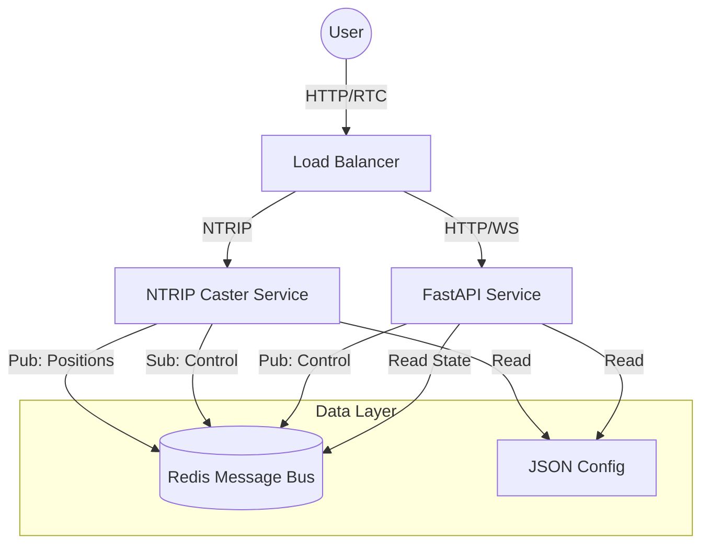

# NTRX Architecture

## Overview

NTRX is a high-performance, asynchronous NTRIP Caster written in Python. It leverages Redis for Inter-Process Communication (IPC), enabling features such as live position streaming, remote session control (kill switch), and shared state publishing. The core NTRIP Caster (source/client connections and data relay) operates independently of Redis; when Redis is unavailable, the system runs in degraded mode with IPC features disabled.

## High-Level Design



## Detailed Component Interaction

```text
+---------------------+       +----------------------+       +-----------------------+
|  NTRIP Sources      | --->  |   NTRX Caster        | --->  |   NTRIP Clients       |
|  (Base Stations)    | <---  |   (AsyncIO Loop)     | <---  |   (Rovers)            |
+---------------------+       +----------+-----------+       +-----------------------+
                                         |
                                         | (Internal Event: Client Position)
                                         v
                              +----------------------+
                              |   Redis Pub/Sub      |
                              |   Channel: positions |
                              +----------+-----------+
                                         ^
                                         |
+---------------------+       +----------+-----------+
|  Admin / API User   | --->  |   FastAPI Service    |
|  (Kill Switch)      |       |   (AsyncIO Loop)     |
+---------------------+       +----------+-----------+
                                         |
                                         v
                              +----------------------+
                              |   Redis Pub/Sub      |
                              |   Channel: control   |
                              +----------------------+
```

## Redis Schema

The system uses Redis as the central nervous system for state and control.

### Channels (Pub/Sub)

| Channel Name      | Publisher | Subscriber | Payload (JSON)                                      | Description |
|-------------------|-----------|------------|---------------------------------------------------|-------------|
| `ntrip:positions` | Caster    | Consumers  | `{"username": "u1", "nmea": "$..", "ts": 123.4}` | Live stream of client positions (NMEA GPGGA). |
| `ntrip:control`   | API       | Caster     | `{"action": "kill", "username": "u1"}`            | Control commands to manage active sessions. |

### Keys (State)

| Key                 | Type   | Content (JSON) | Description |
|---------------------|--------|----------------|-------------|
| `ntripcaster_state` | String | `{ "sources": {...}, "clients": {...} }` | Periodic snapshot of connected agents and their stats. Updated by Caster. |

## Dependencies & Requirements

*   **Python 3.12+**: Relies on modern `asyncio`.
*   **Redis**: Required for full system functionality (IPC, control channel, position streaming, shared state). The NTRIP Caster itself can run without Redis in degraded mode — core data relay between sources and clients works, but live state publishing, position streaming, and the kill switch will be unavailable.
*   **FastAPI**: Used for the control API.
*   **Uvicorn**: ASGI Server for FastAPI.

## Scalability Estimation

*   **Concurrency**: Built on `asyncio`. A single Python process can efficiently handle 1k-5k concurrent connections depending on message frequency.
*   **Redis**: Redis Pub/Sub is extremely high throughput (>1M ops/sec), ensuring the "Map View" feature does not bottleneck the Caster.
*   **Horizontal Scaling**: 
    *   **API**: Stateless, scales indefinitely.
    *   **Caster**: Sources connection state is local. For >10k users, sharding by mountpoint or a custom redis-backed source sharing layer is needed.

## Operational Modes (Planned)

| Mode | State Storage | Redis | Horizontal Scaling |
|------|--------------|-------|--------------------|}
| **Standalone** *(current)* | In-memory | Optional (IPC only) | API only |
| **Thin Client** *(planned)* | Redis | Required | Full (Caster + API) |

*   **Standalone**: Mountpoints and connection state are held in-memory. Redis is used only for IPC (positions, control, state). If Redis is unavailable, the caster runs in degraded mode.
*   **Thin Client**: All state is externalized to Redis. The caster becomes stateless, enabling multiple caster instances behind a load balancer with shared mountpoint registry.

## User Interface Implementation Guide

To build a UI (similar to legacy admin panels):

1.  **Map View**:
    *   Connect to a WebSocket endpoint (to be implemented in FastAPI) that bridges `ntrip:positions`.
    *   Overlay markers on a map (Leaflet/Google Maps) based on the stream.
2.  **Dashboard**:
    *   Poll `GET /state` for a list of active sources and clients.
    *   Display throughput (bps) and connection duration.
3.  **Control**:
    *   Add a "Kick" button next to each user.
    *   Button triggers `POST /api/kill/{username}`.

## Functional Parity with Legacy C

| Feature | Legacy C Implementation | NTRX (Redis-Native) |
| :--- | :--- | :--- |
| **Source Table** | Static file or memory struct | Dynamic generation from active memory |
| **Client Auth** | Flat file / MySQL | JSON Config (Extensible to DB) |
| **Kill Switch** | Watch file `/mnt/ramdisk/kill/` | Redis Channel `ntrip:control` |
| **Map Data** | Write to file `/var/www/data/` | Redis Channel `ntrip:positions` |

This architecture ensures exact functional equivalence for the end-user while modernizing the backend for reliability.
